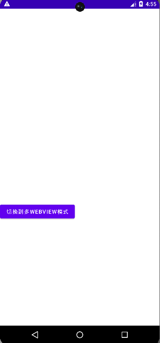

# What is Android-Spider
Wrap WebView as a network-spider program. 

# How to use it?
Install the app on your Android device, This app support >= Android 4.4.

It looks like below after you installed and launched:



Then we use http protocol to communicate with it. I use python's requests to demonstrate.

Let us fetch news from Nature.

```python
import json
import requests

f = """
function () {
    var a = document.querySelectorAll('.c-card__copy');
    var ans = [];
    for (var i = 0; i < a.length; i++) {
        var child = a[i];
        var t = function (s) {
            try {
                var r = child.querySelector(s).innerText.trim();
                if (r) {
                    if (r[r.length - 1] === '.') {
                        return r + ' ';
                    } else {
                        return r + '. ';
                    };
                } else {
                    return '';
                };
            } catch (e) {
                return '';
            };
        };
        ans.push('' + t('.c-card__article-type') + t('.c-card__title') + t('.c-card__standfirst'));
    };
    return JSON.stringify(ans);
}
"""
address = 'http://192.168.0.181:8112/spider'  # using your phone IP
rsp = requests.post(address, data=json.dumps({
    "pageId": "1",  # unique id defined by you, arbitrary text, each requestUrl using a pageId
    "requestUrl": "https://www.nature.com/news",
    "needRefresh": "",  # indicate does the page need refresh, if yes just fill up with any text, if not just hold it empty
    "finishLoadTag": ".c-card__copy",  # CSS selector indicate the page has loaded over
    "function": f,  # the function used to fetch data you needed
    "asyncWay": "",  # indicate does the function need execute as asynchronized way, there is not
    "waitTimeAfterPageLoad": "",
    "retryTimes": "3"  # if function's execution failed, indicate how many times will retry, just type a number
}), timeout=20)

print('you fetched data printed below: ')
print(rsp.text[0: 300] + '...')

```
Output:
```
you fetched data in below: 
["news. Did physicists create a wormhole in a quantum computer?. An unusual teleportation experiment is just ordinary quantum physics, but was inspired by tunnels through an exotic ‘toy universe’. ","Heralded Alzheimer’s drug works — but safety concerns loom. Eisai and Biogen share clinical trial da...
```

# What means of asyncWay ?
It means some page you need to loopily check is the data loaded, such as you are waiting for a translation to be finished.

There have a demonstration:

```python
import json
import requests

f = """
function () {
    if(count === 0){ // count is a built-in variable, it indicate the times runed of function
        // do something just run once
    };
    // the left code will loopily run
    if("your condition reached"){
        return "the data you need"
    };
}
"""
address = 'http://your_phone_ip:8112/spider'
rsp = requests.post(address, data=json.dumps({
    "pageId": "1", 
    "requestUrl": "https://example.com",
    "finishLoadTag": "#CSS_Tag",  
    "function": f,  
    "asyncWay": "1",  # means will use asyncWay
}), timeout=20)
```